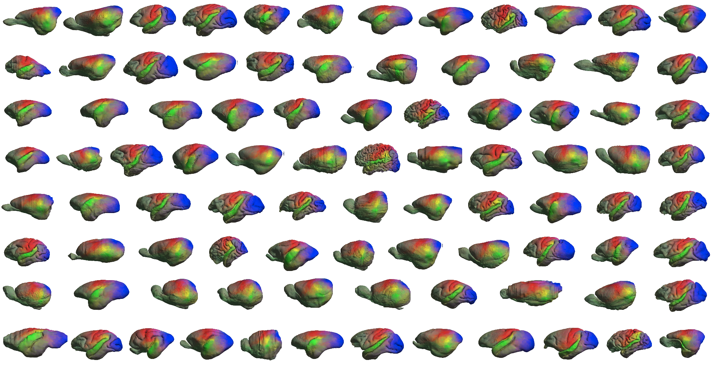
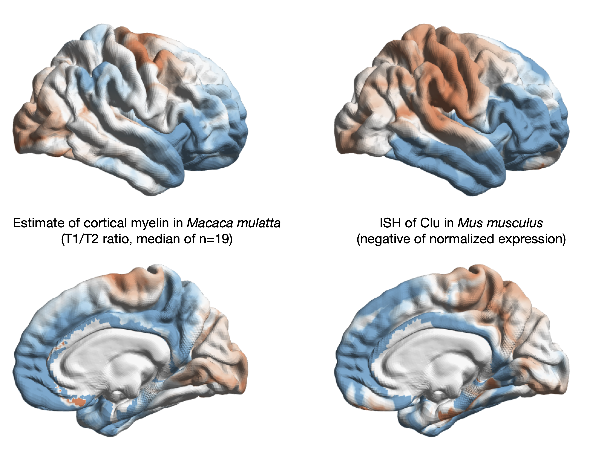

# Evolution of Cortical Geometry and its Link to Function, Behaviour and Ecology



This repository holds the data supporting the findings of _Evolution of Cortical Geometry and its Link to Function, Behaviour and Ecology_ by Ernst Schwartz<sup>1</sup>,  Karl-Heinz Nenning<sup>1,2</sup>, Katja Heuer<sup>5</sup>, Nathan Jeffery<sup>3</sup>, Ornella C. Bertrand<sup>4</sup>, Roberto Toro<sup>5</sup>, Gregor Kasprian<sup>1</sup>, Daniela Prayer<sup>1</sup>, Georg Langs<sup>1,6</sup>

<sup>1</sup>	Department of Biomedical Imaging and Image-guided Therapy, Computational Imaging Research Lab, Medical University Vienna, Vienna, Austria

<sup>2</sup>	Center for Biomedical Imaging and Neuromodulation, Nathan Kline Institute, Orangeburg, NY, USA

<sup>3</sup>	Institute of Life Course & Medical Sciences, University of Liverpool, Liverpool, England

<sup>4</sup>	Institut Català de Paleontologia Miquel Crusafont, Universitat Autònoma de Barcelona Edifici ICTA-ICP, c/ Columnes s/n, Campus de la UAB, 08193 Cerdanyola del Vallès. Barcelona, Spain

<sup>5</sup>	Institut Pasteur, Université Paris Cité, Unité de Neuroanatomie Appliquée et Théorique, F-75015 Paris, France

<sup>6</sup>	Computer Science and Artificial Intelligence Lab, Massachusetts Institute of Technology, Cambridge, USA


### Abstract
Studies in comparative neuroanatomy and of the fossil record demonstrate the influence of socio-ecological niches on the morphology of the cerebral cortex, but have led to oftentimes conflicting theories about its evolution. Here, we study the relationship between the shape of the cerebral cortex and the topography of its function. We establish a joint geometric representation of the cerebral cortices of ninety species of extant Euarchontoglires, including commonly used experimental model organisms. We show that variability in surface geometry relates to species’ ecology and behaviour, independent of overall brain size. Notably, ancestral shape reconstruction of the cortical surface and its change during evolution enables us to trace the evolutionary history of localised cortical expansions, modal segregation of brain function, and their association to behaviour and cognition. We find that individual cortical regions follow different sequences of area increase during evolutionary adaptations to dynamic socio-ecological niches. Anatomical correlates of this sequence of events are still observable in extant species, and relate to their current behaviour and ecology.  We decompose the deep evolutionary history of the shape of the human cortical surface into spatially and temporally conscribed components with highly interpretable functional associations, highlighting the importance of considering the evolutionary history of cortical regions when studying their anatomy and function.

## Tools in this repository
[Phylogenetic trees used in the study](_phylogenies) sampled from [http://vertlife.org/data/mammals/](Vertlife)

[Volumes in MNI space obtained from analysing relationships between cortical morphology and ecological variables as well as its evolution in the deep human lineage](_decodingMaps). These maps are also deposited at [https://neurovault.org/collections/IHFSXSES/](NeuroVault). 

[Surface models of all species used in the study as well as their ancestral state estimates](_surfaces). Here, we provide surface models for the cortices of the 90 different species used in the study, both in their native topologies and in a _Common Phlyogenetic Reference Frame CPRF_ (with the same topology as fsaverage6 from [FreeSurfer](https://surfer.nmr.mgh.harvard.edu/)). Additionally, we provide maps between these spaces to be used in the [Connectome Workbench](https://www.humanconnectome.org/software/connectome-workbench) as well as maps to some additional commonly used reference spaces for mice, rats, macaques and chimpanzees in [_mappings](_mappings). For an example on how to use them and the CPRF, see the following [tutorial](#tutorial).

<b>Ancestral state reconstruction of the human lineage until the Last Common Ancestor of all Euarchontoglires</b> resulted in the following rendering (colors are derived from [Glasser2016](https://doi.org/10.1038/nature18933) and correspond to blue: visual, red: sensor/motor, green: auditory. 1 second corrsponds to 1 million years):

<div align="center">
<video src=https://user-images.githubusercontent.com/4426897/221379161-2966db19-f703-42e0-86c8-8d671e0bd98a.mp4>
</div><br/>

<a name="tutorial"></a>
## Mapping tutorial
Apart for their interesting results on the evolution of cortical shape, the CPRF lends itself to translating results between species. As a proof of concept, we will investigate recent results that link the [Clusterin gene](https://www.genecards.org/cgi-bin/carddisp.pl?gene=CLU) to neurodegenerative diseases such as Alzheimers and myelination ([Beiter2022](https://doi.org/10.1101/2020.03.06.981373), [Fareed2022](https://doi.org/10.3390/biom12101452)). We will use myelin data of Macaques from the [Balsa Database](https://balsa.wustl.edu/reference/976nz) and compare it to gene expression data of Mice from the [Allen Brain Atlas](http://mouse.brain-map.org/experiment/show/275). For simplicity, we only process data on the right hemisphere, but the steps for the left hemisphere are equivalent. Processing requires the Connectome Workbench as well as [FSL tools](https://fsl.fmrib.ox.ac.uk/fsl/fslwiki/FSL) and [Convert3D](http://www.itksnap.org/pmwiki/pmwiki.php?n=Convert3D.Convert3D) to be on the path. These scripts are also available at [_mapping_tutorial](_mapping_tutorial).

### Mapping estimates of cortical myelin in macaques to the CPRF
We start by mapping estimates of Macaque cortical myelin publicly available at [https://balsa.wustl.edu/reference/976nz](https://balsa.wustl.edu/reference/976nz) to the CPRF. First, we define some directories used for the local copy of this repository and some temporary data.

```
PROCESSING_DIR=/a/path/to/some/directory
[[ -d ${PROCESSING_DIR} ]] || mkdir -p ${PROCESSING_DIR}
BALSA_DATA_DIR=/the/path/to/the/local/copy/of/the/balsa/data/MacaqueYerkes19_v1.2_Vj_976nz/MNINonLinear/fsaverage_LR32k
REPO_DIR=/the/path/to/the/local/copy/of/this/repository/EvolutionOfCorticalShape
```

Because the data is defined in the Yerkes19 template space, but in the study we used the [NMTv1.3 space](https://afni.nimh.nih.gov/pub/dist/doc/htmldoc/nonhuman/macaque_tempatl/template_nmtv1.html), we first have to map it to this space. We will use the [Connectome Workbench](https://www.humanconnectome.org/software/connectome-workbench) for this.
We start by defining the source and target spaces and hemisphere

```
SOURCE_SPACE=Yerkes19
TARGET_SPACE=NMTv1.3
HEMI=R
```

Then, we define the input data file. Since this is a cifti file containing data from both hemispheres, we have to first extract data for the target hemisphere

```
# extract metric data from cifti file
IN_FILE_CIFTI=${BALSA_DATA_DIR}/MacaqueYerkes19_v1.2.All.MyelinMap_BC.32k_fs_LR.dscalar.nii
IN_FILE_METRIC=${PROCESSING_DIR}/MacaqueYerkes19_v1.2.All.MyelinMap_BC.32k_fs_LR.${HEMI}.func.gii

if [ $HEMI == "L" ] ; then
	STRUCTURE=CORTEX_LEFT
else
	STRUCTURE=CORTEX_RIGHT
fi

wb_command -cifti-separate ${IN_FILE_CIFTI} COLUMN -metric ${STRUCTURE} ${IN_FILE_METRIC}
```

Now, we can map the data in `${IN_FILE_METRIC}` from the Yerkes19 to NMTv1.3 space

```
# sphere, surface model for yerkes19 data
SPH_SOURCE=${BALSA_DATA_DIR}/MacaqueYerkes19_v1.2.${HEMI}.sphere.32k_fs_LR.surf.gii
MODEL_SOURCE=${BALSA_DATA_DIR}/MacaqueYerkes19_v1.2.${HEMI}.pial.32k_fs_LR.surf.gii

# sphere, surface model for NMT surface model data 
SPH_RESAMPLE=${REPO_DIR}/_mappings/Macaca_mulatta/${HEMI}.${SOURCE_SPACE}-${TARGET_SPACE}.sphere.reg.surf.gii

SPH_TARGET=${REPO_DIR}/_surfaces/sub-028_species-Macaca+mulatta_hemi-${HEMI}.sphere.surf.gii
MODEL_TARGET=${REPO_DIR}/_mappings/Macaca_mulatta/${HEMI}.${TARGET_SPACE}.surf.gii

OUT_FILE=${PROCESSING_DIR}/${HEMI}.yerkes2mnt_mid.func.gii

wb_command -metric-resample ${IN_FILE_METRIC} $SPH_SOURCE $SPH_RESAMPLE ADAP_BARY_AREA ${OUT_FILE} -area-surfs $MODEL_SOURCE $MODEL_TARGET
```

Finally, we can map this to the CPRF

```
OUT_FILE_CPRF=${PROCESSING_DIR}/${HEMI}.yerkes2mnt2cprf_mid.func.gii

SPH_RESAMPLE_CPRF=${REPO_DIR}/_surfaces/sub-028_species-Macaca+mulatta_hemi-${HEMI}_topo-Homo.sapiens.sphere.reg.surf.gii
MODEL_TARGET_CPRF=${REPO_DIR}/_surfaces/sub-028_species-Macaca+mulatta_hemi-${HEMI}_topo-Homo.sapiens.surf.gii

wb_command -metric-resample ${OUT_FILE} $SPH_TARGET $SPH_RESAMPLE_CPRF ADAP_BARY_AREA ${OUT_FILE_CPRF} -area-surfs $MODEL_TARGET $MODEL_TARGET_CPR
```

### Mapping gene expression data from the Allen Brain Atlas to the CPRF

We obtain in-situ hybridization gene expression data of Clusterin from the Allen Brain Atlas. 
```
# get ISH data from ABA
EXPERIMENT_ID=275  # (see http://mouse.brain-map.org/experiment/show/275)
wget http://api.brain-map.org/grid_data/download/${EXPERIMENT_ID}?include=energy,intensity -O ${PROCESSING_DIR}/ish.zip
```

However, data obtained in this way does not define a complete reference frame, so we use that of the [Scalable Brain Atlas](https://scalablebrainatlas.incf.org/mouse/ABA_v3) which we apply to the data

```
pushd $PROCESSING_DIR
unzip ish.zip

# "transform" to SBA space  (see https://scalablebrainatlas.incf.org/mouse/ABA_v3)
c3d energy.mhd -o energy_sba.nii.gz
fslswapdim energy_sba.nii.gz z -x -y energy_sba.nii.gz
c3d energy_sba.nii.gz -orient RPI -spacing 0.2x0.2x0.2mm -origin -5.7x7.825x-2.825mm -o energy_sba.nii.gz

popd
```

We now interpolate the gene expression data to the cortical surface model. Due to data quality, the delineation of the cortical sheet was not always possible for the specimen used in the study, so we relied solely on the outer cortical surface. For interpolating data from a volume to the surface, we therefore use a thin strip inside of the pial surface which we obtain from the surface normals

```
VOLUME=${PROCESSING_DIR}/energy_sba.nii.gz

SURFACE=${REPO_DIR}/_mappings/Mus_musculus/${HEMI}.ABA_CCF3_sba.surf.gii
OUTPUT=${PROCESSING_DIR}/mouse_aba-sba-Clu275_${HEMI}.func.gii

# this value is derived from the voxel size of the input volume to reduce the number of "missed" voxels due to interpolation
offset=0.1

## --- GENERATE A 'PSEUDO' CORTICAL RIBBON AROUND THE PROVIDED PIAL SURFACE ---
# convert to metric file
wb_command -surface-coordinates-to-metric ${SURFACE} ${PROCESSING_DIR}/$(basename ${SURFACE/.surf.gii/.func.gii})
# store surface normals
wb_command -surface-normals ${SURFACE} ${PROCESSING_DIR}/$(basename ${SURFACE/.surf.gii/normals.func.gii})
# generate inner ribbon placeholder file
wb_command -metric-math x-${offset}*y ${PROCESSING_DIR}/$(basename ${SURFACE/.surf.gii/inner.func.gii}) -var x ${PROCESSING_DIR}/$(basename ${SURFACE/.surf.gii/.func.gii}) -var y ${PROCESSING_DIR}/$(basename ${SURFACE/.surf.gii/normals.func.gii})
wb_command -surface-set-coordinates ${SURFACE} ${PROCESSING_DIR}/$(basename ${SURFACE/.surf.gii/inner.func.gii}) ${PROCESSING_DIR}/$(basename ${SURFACE/.surf.gii/inner.surf.gii})

# interpolate value volume to surface
wb_command -volume-to-surface-mapping ${VOLUME} ${SURFACE} ${OUTPUT} -ribbon-constrained ${PROCESSING_DIR}/$(basename ${SURFACE/.surf.gii/inner.surf.gii}) ${SURFACE} -volume-roi $VOLUME

```

Instead of the ABA, we used data from [Calabrese2015](https://doi.org/10.1093/cercor/bhv121) for the construction of the CPRF, so just as for the Macaque data, we have to apply an additional mapping 

```
SOURCE_SPACE=ABA_CCF3_sba
TARGET_SPACE=CIVM_DWI

IN_FILE_METRIC=${OUTPUT}

# sphere, surface model for ABA data
SPH_SOURCE=${REPO_DIR}/_mappings/Mus_musculus/${HEMI}.${SOURCE_SPACE}.sphere.surf.gii
MODEL_SOURCE=${REPO_DIR}/_mappings/Mus_musculus/${HEMI}.${SOURCE_SPACE}.surf.gii

SPH_RESAMPLE=${REPO_DIR}/_mappings/Mus_musculus/${HEMI}.${SOURCE_SPACE}-${TARGET_SPACE}.sphere.reg.surf.gii

SPH_TARGET=${REPO_DIR}/_surfaces/sub-043_species-Mus+musculus_hemi-${HEMI}.sphere.surf.gii
MODEL_TARGET=${REPO_DIR}/_surfaces/sub-043_species-Mus+musculus_hemi-${HEMI}.surf.gii

OUT_FILE=${PROCESSING_DIR}/mouse_aba-sba_civm-dwi-Clu275_${HEMI}.func.gii

# map to CIVM_DWI
wb_command -metric-resample ${IN_FILE_METRIC} $SPH_SOURCE $SPH_RESAMPLE ADAP_BARY_AREA ${OUT_FILE} -area-surfs $MODEL_SOURCE $MODEL_TARGET
```

With this, we can now finally map the ISH data to the CPRF

```
OUT_FILE_CPRF=${PROCESSING_DIR}/mouse_aba-sba2civm-dwi2cprf-Clu275_${HEMI}.func.gii

SPH_RESAMPLE_CPRF=${REPO_DIR}/_surfaces/sub-043_species-Mus+musculus_hemi-${HEMI}_topo-Homo.sapiens.sphere.reg.surf.gii
MODEL_TARGET_CPRF=${REPO_DIR}/_surfaces/sub-043_species-Mus+musculus_hemi-${HEMI}_topo-Homo.sapiens.surf.gii

wb_command -metric-resample ${OUT_FILE} $SPH_TARGET $SPH_RESAMPLE_CPRF ADAP_BARY_AREA ${OUT_FILE_CPRF} -area-surfs $MODEL_TARGET $MODEL_TARGET_CPRF
```

### Comparing Clusterin expression in Mice and cortical myelin in Macaques

After mapping both datasets to the CPRF, we can now compare them both qualitatively and quantitatively. First, we plot both datasets on the human fsaverage6 template

<p align="center">

</p>

We use Spin Tests ([Alexander-Bloch2018](https://doi.org/10.1016/j.neuroimage.2018.05.070)) to measure the correlation between the two surface maps in the CPRF, obtaining a Pearson correlation coefficient of -0.4331 with p<1e-3. This indicates that there is indeed an evolutionary conserved negative relationship between the expression of Clusterin and the amount of myelin in the cortex.
